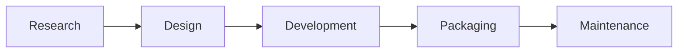

# Build Anything Workflow

## Purpose

This document defines the higher-level product delivery chain for building almost anything with the repo's document-driven workflow.

It sits one level above the canonical 15-stage workflow:

- the **Build Anything workflow** is the strategic view
- the **canonical workflow** is the execution and enforcement view

Use the Build Anything workflow when deciding what the full lifecycle should look like from vague topic to shipped and maintained product.

## The 5 Macro Phases

The recommended end-to-end chain is:

This model is intentionally broader than the current canonical workflow. It captures the full product lifecycle, not just the currently enforced implementation loop.

## Phase Outputs

| Phase | Goal | Primary outputs |
|------|------|-----------------|
| Research | Stop building from thin air by anchoring the topic to reality | research brief, product anchor decision, screenshot evidence pack, short recommendation brief |
| Design | Turn the anchored idea into explicit product and execution definitions | clarified intake, task classification, scope estimate, PRD, PRD reality review, user flow, human approval, implementation plan, plan review, execution prompt |
| Development | Implement in bounded batches with explicit review and gates | code changes, batch execution reports, Codex review reports, phase gate decisions, final revision report |
| Packaging | Turn working code into a clean deliverable | integration checklist, final verification evidence, merge-ready branch state, release-facing docs or demo assets, documented follow-ups |
| Maintenance | Feed learning back into the next cycle | next-cycle brief, backlog or debt list, polish opportunities, future spec candidates |

## Detailed Output Contract

### 1. Research

Research is the missing pre-plan phase that happens before PRD writing.

Recommended outputs:

- `Research brief`
  - topic
  - target user or job
  - product category guess
- `Primary anchor`
  - the closest market-facing product
- `Secondary anchor`
  - a second product covering an important missing surface or interaction
- `Similarity note`
  - rough fit such as `70-80% like TradingView, with onboarding closer to Instagram`
- `Evidence pack`
  - key pages
  - key flows
  - screenshots or stable links
- `Design implication`
  - one short statement describing what later PRD or prototype work should roughly look like

This is where `product-research` belongs.

### 2. Design

Design translates the research result into explicit documents that another agent can execute with minimal drift.

Current repository outputs:

- `handoffs/00-intake.md`
- `handoffs/05-task-classification.yaml`
- `handoffs/08-scope-estimate.md`
- `handoffs/10-prd.md`
- `handoffs/15-prd-reality-review.md`
- `handoffs/20-user-flow.md`
- `handoffs/21-user-flow.yaml`
- `handoffs/25-human-approval.md`
- `handoffs/30-implementation-plan.md`
- `handoffs/32-execution-workflow.yaml`
- `handoffs/35-plan-review.md`
- `handoffs/40-execution-prompt.md`

In short, the Design phase outputs:

- product definition
- user journey definition
- execution definition
- explicit approval to build

### 3. Development

Development is the bounded implementation loop.

Current repository outputs:

- `handoffs/50-claude-batch-r{round}.md`
- `handoffs/60-codex-review-r{round}.md`
- major phase gate decisions
- `handoffs/90-claude-final.md`
- the code changes themselves

This phase is complete only when:

- implementation exists
- required tests were run
- review gates passed
- major dependencies were not skipped

### 4. Packaging

Packaging starts after coding is functionally done.

It exists to turn "working" into "deliverable."

Typical outputs:

- `handoffs/95-integration-checklist.md`
- final verification evidence
- final build or deploy confirmation when applicable
- merge-ready branch
- cleaned temporary artifacts
- release-facing materials such as:
  - updated README
  - screenshots
  - demo notes
  - changelog or release notes

The current canonical workflow partially covers this through `Integrate, Merge, and Clean Up`, but the Build Anything model makes it explicit as its own phase.

### 5. Maintenance

Maintenance turns shipped work into the input for the next iteration.

Current repository output:

- `handoffs/99-next-cycle.md`

Recommended broader outputs:

- architectural debt list
- deferred cleanup list
- product polish opportunities
- performance follow-ups
- next spec or PRD candidates

## Mapping to the Current Canonical Workflow

The current repository enforces 15 stages grouped into 4 canonical phases:

- `intention_framing`
- `document_authoring`
- `code_execution`
- `integration_cleanup`

The Build Anything workflow maps onto that system like this:

| Build Anything phase | Current canonical coverage |
|------|---------------------------|
| Research | not yet modeled as a first-class enforced phase; should happen before or at the very start of `intention_framing` |
| Design | `intention_framing` + `document_authoring` |
| Development | `code_execution` |
| Packaging | the delivery-facing part of `integration_cleanup` |
| Maintenance | the reflection and next-cycle part of `integration_cleanup` |

## Recommended Reading Order

If someone is new to the repo, the right order is:

1. Read this file for the full product delivery chain.
2. Read `docs/development-workflow.md` for the enforced 15-stage execution model.
3. Read `docs/canonical-workflow.json` or `docs/canonical-workflow.yaml` for stage-by-stage mapping.

## Current Recommendation

Treat the 5-phase Build Anything workflow as the full lifecycle model.

Treat the 15-stage canonical workflow as the current executable implementation of the middle of that lifecycle.
