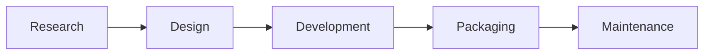

# Development Workflow

## Purpose

This document is the canonical instruction set for document-driven software delivery using raw terminal sessions.

For the higher-level end-to-end product lifecycle, read `docs/build-anything-workflow.md`.
The machine-readable source of truth lives in `docs/canonical-workflow.json`, which currently defines 5 phases and 22 stages.
This prose file is the human-readable explanation of that execution model.

It exists to minimize drift, ambiguity, and low-quality execution by separating:

- planning from implementation
- review from coding
- durable documents from machine state

This workflow is intentionally tool-light:

- terminals only
- documents only
- git repos only
- skills when useful

No external orchestrator is required.

## Operating Constraints

Current role mapping:

- `human`: owns goals, priorities, tradeoffs, approvals, and final decisions
- `Codex`: planner, spec writer, reviewer, and process controller
- `Claude Code`: coder and revision executor
- `Gemini`: not used in the default v1 flow

Current environment assumptions:

- work happens from raw terminal sessions
- all collaboration is recorded in documents
- machine lifecycle state may live outside markdown in `system/state.json`
- task execution may use scripts and skills, but documents remain the collaboration surface

Out of scope for this workflow:

- Conductor
- Agent of Empires
- AO / Composio Agent Orchestrator
- Paperclip
- automatic PR comment sync
- CI-driven autonomous retries

## Core Philosophy

### Script First

Use scripts whenever the task can be deterministic.

Why:

- deterministic behavior
- no token cost
- easier verification

Typical script steps:

- create folders
- generate diffs
- run tests
- run lint
- validate YAML or JSON
- update `system/state.json`

### LLM When Judgment Is Required

Use an LLM step only when the task requires interpretation, synthesis, design, review, or writing that cannot be made purely deterministic.

Typical LLM steps:

- task classification
- scope estimation
- PRD drafting
- user-flow drafting
- implementation-plan drafting
- code review
- revision planning

### Human Approval Gate for High Risk

Require explicit human approval when:

- PRD and user flow need product sign-off
- scope expands beyond the approved requirement
- the workflow touches secrets, private keys, or production credentials
- the workflow attempts destructive actions
- the workflow fails to converge after bounded retries

### Documents Are the Collaboration Surface

Documents hold:

- intent
- specifications
- plans
- handoffs
- reviews
- approvals
- final conclusions

Machine state files hold:

- lifecycle counters
- current stage
- lock state
- stop reason

### Append-Only Handoffs

Do not rewrite history.

Every agent-to-agent or human-to-agent handoff creates a new document. Old handoffs remain read-only.

## Two Workflow Views

This repository now has two valid workflow views:

1. **Build Anything workflow**
   The full product lifecycle:
   `Research -> Design -> Development -> Packaging -> Maintenance`
2. **Canonical workflow**
   The currently enforced 15-stage execution model used by scripts and the dashboard

The Build Anything workflow is the strategic model.
The canonical workflow is the operational model.

## Build Anything Macro Lifecycle

Recommended left-to-right lifecycle:



### Phase Outputs

| Phase | Required result |
|------|------------------|
| Research | A concrete anchor on real products, with screenshot evidence and a short recommendation brief |
| Design | Explicit documents that define product intent, user flow, approval state, and execution plan |
| Development | Working code plus bounded execution reports, review reports, and final revision evidence |
| Packaging | Clean integration, final verification, merge readiness, and delivery-facing artifacts |
| Maintenance | Captured debt, learnings, follow-ups, and the next-cycle candidate |

### Mapping to the Current Canonical Workflow

| Build Anything phase | Canonical workflow mapping |
|------|-----------------------------|
| Research | Upstream of the current enforced flow; should happen before or at the start of Stage 0 |
| Design | Stages 0-8 |
| Development | Stages 9-12 |
| Packaging | Stage 13 |
| Maintenance | Stage 14 |

Important:

- Research is recommended as a first-class lifecycle phase even though it is not yet modeled in `docs/canonical-workflow.json`
- Packaging and Maintenance are separated conceptually even though the current canonical workflow groups them inside `integration_cleanup`

## Task Lifecycle

The canonical lifecycle is:

1. Clarify objective
2. Classify task and estimate size
3. Draft PRD
4. Review PRD against the real codebase or environment
5. Draft user flow
6. Human approval gate for PRD and user flow
7. Draft implementation plan
8. Review implementation plan
9. Write execution prompt for Claude Code
10. Claude Code executes in batches
11. Codex reviews each batch
12. Gate each major phase
13. Claude Code performs final revision
14. Integrate, merge, and clean up
15. Reflect and define the next cycle

Default delivery model by task size:

- `small`: may use a simplified two-review flow
- `medium`: should use batch execution and explicit phase gates
- `large`: must use batch execution, phase gates, and more detailed PRD and plan artifacts

## Task Classification and Sizing

Every task must be classified before PRD drafting.

### Task Type

Use exactly one primary type:

- `feature`
- `new_project`
- `bug_fix`
- `optimization`

### Task Size

Use exactly one size:

- `small`
- `medium`
- `large`

### Size Rules

- `small`: lean PRD, lean plan, simplified review loop allowed
- `medium`: standard PRD, standard plan, batch execution recommended
- `large`: full PRD, explicit user flow, explicit phase gates, stronger review discipline

## Required Skills by Stage

Use these skills when available:

- task estimation: agent estimation skill, if available
- PRD drafting: Ralph PRD skill
- user-flow design: agent-canvas, if available
- implementation plan: `superpowers:writing-plans`

Guidance:

- estimation output belongs to scoping, not inside the PRD core body
- user flow belongs to the PRD stage and must be approved before implementation planning
- implementation planning starts only after approved PRD and approved user flow exist
- if a recommended skill is available for the current stage, the agent should use it or explicitly explain why it is being skipped

## Stage Contracts

### Stage 0: Clarify Objective

Owner: `Codex`

Step type: `llm`

Goal:

- identify the real unit of work before implementation starts

Required outputs:

- clear objective
- clear success condition
- clear scope boundary

Runtime rules:

- this stage is a distinct interaction stage and must not be silently collapsed into later drafting
- if objective, success condition, or scope boundary are still ambiguous, `Codex` must ask the human focused clarification questions and stop
- do not proceed to task classification until the clarification answers are either explicit in the human input or captured through a clarification turn
- stage 0 completes only after the intake artifact reflects clarified human intent rather than self-inferred assumptions

### Stage 1: Classify Task and Estimate Size

Owner: `Codex`

Step type: `llm`

Required outputs:

- task type
- task size
- estimate summary
- rationale for size

### Stage 2: Draft PRD

Owner: `Codex`

Step type: `llm`

Required PRD contents:

- purpose
- scope
- non-goals
- contracts
- expected behavior
- acceptance criteria
- constraints
- terminology

### Stage 3: Review PRD Against Reality

Owner: `Codex`

Step type: `llm` plus script-assisted repo inspection

Purpose:

- correct mismatches between the drafted PRD and the real repo or environment

Required outputs:

- corrected PRD
- contradiction list resolved
- explicit baseline assumptions

### Stage 4: Draft User Flow

Owner: `Codex`

Step type: `llm`

This step must produce both:

- a human-readable user flow
- a structured YAML version

Structured YAML requirements:

- every step must define `inputs`
- every step must define `outputs`
- every step must define `validation`
- every step must define `failure`
- every step must define `next`

### Stage 5: Human Approval Gate

Owner: `human`

Step type: `human_gate`

Approval is required for:

- PRD
- user flow

Without approval, the workflow must not proceed to implementation planning.

Artifact rules:

- `handoffs/25-human-approval.md` may begin as a pending approval request drafted by `Codex`
- the human decision must overwrite the file with the final approval or revision outcome before implementation planning proceeds
- once the gate is pending, machine state should move to `status: waiting`

### Stage 6: Draft Implementation Plan

Owner: `Codex`

Step type: `llm`

The plan must translate the approved PRD and approved user flow into:

- phases
- batches
- task order
- likely file touchpoints
- verification steps
- stop conditions

### Stage 7: Review Implementation Plan

Owner: `Codex`

Step type: `llm`

Purpose:

- harden the plan until another agent can execute it with minimal interpretation drift

Required outputs:

- reviewed plan
- clarified execution order
- clarified verification commands
- clarified dependency boundaries

### Stage 8: Write Execution Prompt

Owner: `Codex`

Step type: `llm`

This prompt is a formal handoff, not an informal chat message.

It must define:

- repository path
- PRD path
- implementation plan path
- source-of-truth rules
- execution order
- stop conditions
- logging requirements
- report format
- forbidden behaviors

### Stage 9: Claude Code Executes in Batches

Owner: `Claude Code`

Step type: `llm` plus scripts

Rules:

- do not implement the whole task in one unbounded run
- work in small batches
- create durable execution reports

Each batch report must contain:

- tasks completed
- files changed
- tests run
- result
- next proposed batch

### Stage 10: Codex Reviews Each Batch

Owner: `Codex`

Step type: `llm`

Review must cover:

- bugs
- regressions
- missing tests
- contract violations
- architectural drift
- incorrect assumptions

Batch gate decisions:

- `proceed`
- `fix_before_proceeding`
- `stop_and_rethink`

### Stage 11: Gate Each Major Phase

Owner: `Codex`, with human escalation when needed

Purpose:

- prevent downstream work before upstream contracts are verified

Typical phase gates:

- backend before UI
- infrastructure before workflow logic
- data model before feature layer
- refactor before product polish

### Stage 12: Final Revision

Owner: `Claude Code`

Rule:

- after the second Codex review in the simplified flow, Claude Code performs one final revision
- that output is treated as the final version for v1 unless human escalation is required

### Stage 13: Integrate, Merge, and Clean Up

Owners: `human` and `Codex`

Required completion work:

- final test verification
- final build verification when applicable
- branch hygiene
- merge readiness check
- merge
- cleanup of branches, worktrees, and temp files
- documented follow-ups

Delivery is complete only when integration is clean, not when coding stops.

### Stage 14: Reflect and Define the Next Cycle

Owners: `human` and `Codex`

Required reflection topics:

- architectural debt
- deferred cleanup
- legacy removal
- product polish
- performance improvement opportunities
- next spec or plan candidate

## Simplified Small-Task Review Loop

For `small` tasks, the default bounded loop is:

1. Codex writes PRD
2. Codex reviews PRD against reality
3. Codex writes implementation plan
4. Codex reviews implementation plan
5. Codex writes execution prompt
6. Claude Code implements v1
7. Codex review round 1
8. Claude Code revision 1
9. Codex review round 2
10. Claude Code final revision

No third Codex review is required in the default small-task v1 flow.

## Medium and Large Task Rule

For `medium` and `large` tasks:

- implementation must proceed in batches
- each batch must be reviewed before the next one
- major phase boundaries must be explicitly gated

Do not collapse a medium or large task into a single uninterrupted implementation run unless the human explicitly approves that deviation.

## Document Contracts

Each live task must have a task directory.

Recommended shape:

```text
tasks/TASK-YYYY-MM-DD-short-name/
  status.md
  decision-log.md
  handoffs/
    00-intake.md
    05-task-classification.yaml
    08-scope-estimate.md
    10-prd.md
    15-prd-reality-review.md
    20-user-flow.md
    21-user-flow.yaml
    25-human-approval.md
    30-implementation-plan.md
    32-execution-workflow.yaml
    35-plan-review.md
    40-execution-prompt.md
    50-claude-batch-r1.md
    60-codex-review-r1.md
    70-claude-batch-r2.md
    80-codex-review-r2.md
    90-claude-final.md
    95-integration-checklist.md
    99-next-cycle.md
  system/
    state.json
    run-log.jsonl
    lock
```

### status.md

Purpose:

- current summary only

Must include:

- current stage
- current owner
- current round or batch
- latest conclusion
- blockers
- next step

### decision-log.md

Purpose:

- record durable decisions only

Typical entries:

- scope approved
- user flow revised
- review gate blocked
- final revision accepted as delivery artifact

### handoffs

Purpose:

- primary collaboration artifacts

Rules:

- every handoff is append-only
- do not overwrite old rounds
- each handoff should be self-contained enough for the next actor

### system/state.json

Purpose:

- machine state only

Expected keys:

- `status`
- `stage`
- `round`
- `current_actor`
- `last_artifact`
- `stop_reason`

## Handoff Frontmatter Contract

Every handoff document should begin with machine-friendly frontmatter.

Example:

```yaml
---
task_id: TASK-2026-03-15-example
author: codex
role: reviewer
round: 1
inputs:
  - handoffs/50-claude-batch-r1.md
status: completed
next_actor: claude
---
```

Required body sections vary by artifact, but should stay explicit and stable.

## Structured Workflow Schema

Every executable step should be expressible in this shape:

```yaml
id: prd_draft
name: Draft PRD
actor: codex
step_type: llm
inputs:
  - handoffs/00-intake.md
outputs:
  - handoffs/10-prd.md
validation:
  type: schema
  schema: prd_v1
failure:
  on_validation_error: retry_once
  on_semantic_gap: escalate_to_human
next:
  - prd_reality_review
```

Required step fields:

- `id`
- `name`
- `actor`
- `step_type`
- `inputs`
- `outputs`
- `validation`
- `failure`
- `next`

Allowed `step_type` values:

- `script`
- `llm`
- `human_gate`

## User Flow Outputs

The PRD stage must produce:

- `user-flow.md`
- `user-flow.yaml`

### user-flow.md

This is the human-readable product flow.

It should answer:

- who the user is
- where the user enters
- what the user sees
- what the user does
- how the system responds
- what successful completion looks like

### user-flow.yaml

This is the structured representation used for validation and later planning.

Recommended shape:

```yaml
task_id: TASK-2026-03-15-example
flow_name: example-flow
steps:
  - id: entry
    name: User enters workflow
    actor: user
    step_type: script
    goal: Capture initial input
    inputs:
      - raw_request
    outputs:
      - normalized_request
    validation:
      type: schema
      schema: normalized_request_v1
    failure:
      on_validation_error: stop_and_revise
    next:
      - classify_task
```

## Execution Workflow Output

Implementation planning should also produce `execution-workflow.yaml`.

Purpose:

- describe how scripts, LLM steps, and human gates connect during execution

This file is separate from `user-flow.yaml`.

Why:

- `user-flow.yaml` expresses product and user logic
- `execution-workflow.yaml` expresses delivery logic

Do not collapse them into one file.

## Human Approval Gates

A human gate should produce a short approval artifact.

Example:

```yaml
---
task_id: TASK-2026-03-15-example
author: codex
role: planner
gate: prd_user_flow
status: pending
next_actor: human
---
```

Suggested body sections:

- `Decision`
- `Notes`
- `Constraints`

After the human decides, update the same file to reflect the final approval state and human ownership.

Required human gates:

- PRD approval
- user-flow approval

Required escalation gates:

- touching secrets or private keys
- destructive operations
- unexpected scope growth
- unresolved contradiction after bounded retries

## Terminal Execution Rules

Any terminal agent using this workflow must obey these rules:

1. Read `Development Workflow.md` before acting.
2. Read all prerequisite task documents before acting.
3. Advance at most one canonical stage per workflow cycle.
4. When entering a stage, write state first, then write artifacts, then log completion or waiting.
5. At human gates, stop instead of speculating past approval.
3. Do not guess missing context.
4. If required inputs are missing, stop and record the blocker.
5. Prefer scripts over LLMs.
6. Produce a new handoff for every meaningful transition.
7. Update `status.md` and `system/state.json` after each stage.
8. Do not skip validation.
9. Do not silently expand scope.
10. Stop on human-gate conditions and wait for approval.

## LLM Harness Requirements

Every LLM step must have:

- a prompt contract
- an input contract
- an output contract
- a validation contract
- a failure contract

Minimum validation expectations:

- required file exists
- frontmatter parses
- required sections exist
- YAML parses
- enum fields use allowed values
- review outputs contain explicit decisions

No LLM step should emit freeform text alone when the output must drive later execution.

## Review and Revision Protocol

### Review Output Requirements

A review artifact must explicitly state:

- findings
- severity or priority if relevant
- required changes
- optional improvements
- gate decision

Allowed gate decisions:

- `proceed`
- `fix_before_proceeding`
- `stop_and_rethink`

### Revision Output Requirements

A Claude Code revision artifact must explicitly state:

- what changed
- what files changed
- what was intentionally left unchanged
- what tests or verification steps ran
- any blocker still present

## Integration and Cleanup

Before closing a task, confirm:

- required tests have run
- required build checks have run when relevant
- repo state is understandable
- merge readiness is documented
- temporary work artifacts are cleaned up or intentionally preserved
- follow-up items are written down

## Stop Conditions and Escalation

Stop the workflow when any of these is true:

- approved PRD is missing
- approved user flow is missing
- required inputs are missing
- a high-risk action requires human approval
- a validation failure cannot be resolved within bounded retry
- repository verification is blocked
- the configured review-round limit is reached
- a phase gate fails

For the simplified small-task flow, the default review limit is two Codex review rounds followed by one Claude Code final revision.

## Why This Workflow Works

This workflow reduces common failure modes:

- coding before requirements are stable
- planning before the baseline is understood
- reviewing only at the very end
- losing state in chat-only interaction
- letting agents improvise architecture or execution protocol

It creates a controlled loop:

- define
- verify
- plan
- execute
- review
- gate
- integrate
- repeat

## Appendix A: Current Mapping

Current default mapping:

- `Codex`: planner, PRD writer, plan writer, reviewer, process controller
- `Claude Code`: implementation executor and revision executor
- `Gemini`: unused in the default v1 flow

## Appendix B: Standard Filenames

Canonical filenames for task execution:

- `status.md`
- `decision-log.md`
- `handoffs/10-prd.md`
- `handoffs/15-prd-reality-review.md`
- `handoffs/20-user-flow.md`
- `handoffs/21-user-flow.yaml`
- `handoffs/25-human-approval.md`
- `handoffs/30-implementation-plan.md`
- `handoffs/32-execution-workflow.yaml`
- `handoffs/35-plan-review.md`
- `handoffs/40-execution-prompt.md`
- `handoffs/95-integration-checklist.md`
- `handoffs/99-next-cycle.md`
- `system/state.json`

## Appendix C: Short Reusable Form

The shortest reusable form of this workflow is:

1. human states intent
2. Codex classifies the task and estimates size
3. Codex writes the PRD
4. Codex reviews the PRD against reality
5. Codex writes the user flow
6. human approves PRD and user flow
7. Codex writes the implementation plan
8. Codex reviews the plan
9. Codex writes the execution prompt
10. Claude Code implements in batches
11. Codex reviews each batch and gates phase transitions
12. Claude Code performs final revision
13. human and Codex integrate, clean up, and define the next cycle
